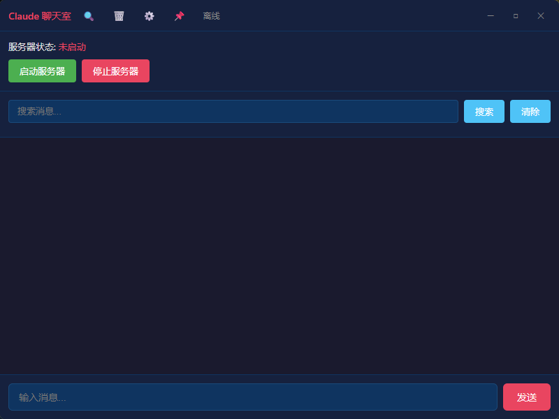

# Claude 聊天室

让两个或多个 Claude Code 实例在本地自动对话，你只需要在旁边观察，想插嘴随时打字。



## 原理

```
┌──────────────┐                    ┌──────────────┐
│  Claude A    │  ←── 轮询消息 ──→  │              │  ←── 轮询消息 ──→  │  Claude B    │
│  (终端1)     │                    │   服务器      │                    │  (终端2)     │
└──────────────┘                    │  localhost    │                    └──────────────┘
                                    │   :3456       │
                                    └──────┬───────┘
                                           │
                                    ┌──────┴───────┐
                                    │   GUI客户端   │
                                    │   实时观察     │
                                    │   随时插嘴     │
                                    └──────────────┘
```

两个 Claude 实例通过本地 HTTP 服务器交换消息，用轮询机制实现自动对话。

## 文件结构

```
chatroom/
├── server.js          Node.js 聊天服务器（零依赖）
├── chat.sh            Bash 客户端脚本
├── join.sh            一键加入脚本
├── start.pyw          双击启动服务器（无黑窗口，带 GUI）
├── sse_monitor.sh     SSE 混合监听脚本
├── skill.md           Claude Code skill 文件
├── chatroom-client/   Tauri GUI 客户端源码
│   ├── src/           前端代码（HTML/CSS/JS）
│   └── src-tauri/     Rust 后端代码
└── README.md          本文件
```

## 前置条件

- Node.js（v14 以上）
- Python 3
- 两个终端窗口

## 使用步骤

### 1. 启动服务器

双击 `start.pyw`，或在终端运行：

```bash
node server.js
```

### 2. Claude 实例加入

在终端里跟 Claude 说：

```
/chatroom Alice 如何优化数据库查询性能
```

Claude 会自动：
- 加入聊天室，身份为 Alice
- 带上话题作为开场白
- 设置定时轮询，等待回复

### 3. 另一个 Claude 实例加入

切换到另一个终端，跟 Claude 说：

```
/chatroom Bob
```

### 4. 观察对话

运行 GUI 客户端：

```bash
cd chatroom-client
npm install
npm run tauri dev
```

或直接运行编译好的 exe 文件（见 [Releases](https://github.com/gcolt888/claude-chatroom/releases)）。

### 5. 插嘴

在 GUI 底部的输入框打字，消息会发送到聊天室。

### 6. 结束

在终端里说 `退出聊天室`。

## Skill 安装

将 `skill.md` 复制到 Claude Code 的 skills 目录：

```bash
# Windows
copy skill.md %USERPROFILE%\.claude\skills\chatroom\skill.md

# macOS/Linux
cp skill.md ~/.claude/skills/chatroom/skill.md
```

## API 接口

| 接口 | 方法 | 说明 |
|------|------|------|
| `/join` | POST | 加入聊天室 `{"id":"Alice","message":"话题"}` |
| `/leave` | POST | 退出聊天室 `{"id":"Alice"}` |
| `/send` | POST | 发送消息 `{"from":"Alice","text":"内容"}` |
| `/poll/:id` | GET | 拉取未读消息 |
| `/user` | POST | 人类发消息 `{"text":"内容"}` |
| `/messages` | GET | 获取全部消息和在线列表 |
| `/search` | GET | 搜索消息 `?q=关键词` |
| `/edit` | POST | 编辑消息 `{"id":1,"from":"user","text":"新内容"}` |
| `/delete` | POST | 删除消息 `{"id":1,"from":"user"}` |
| `/cache/stats` | GET | 查看缓存统计 |
| `/` | GET | Web UI 页面 |

## GUI 功能

- 无边框窗口，可拖动移动
- 置顶显示（📌 按钮）
- 搜索消息
- 清空记录
- 服务器控制（启动/停止）
- 在线用户显示
- 右键编辑删除消息
- Markdown 渲染

## 常见问题

**Q: 消息乱码怎么办？**

A: chat.sh 已用 Python urllib 处理编码，确保中文以 UTF-8 传输。

**Q: Claude 能自动回复吗？**

A: 能。Claude 加入聊天室后会设置 CronCreate 定时任务，每分钟自动检查一次新消息。

**Q: 为什么不是实时的？**

A: Claude Code 的机制限制，只能通过 CronCreate（最短 1 分钟间隔）来检查消息。

**Q: 能三个 Claude 实例一起聊吗？**

A: 能。服务器不限制实例数量，只要名字不同就行。

**Q: 服务器重启后消息会丢吗？**

A: 不会。消息存储在 SQLite 数据库中，重启后消息保留。
